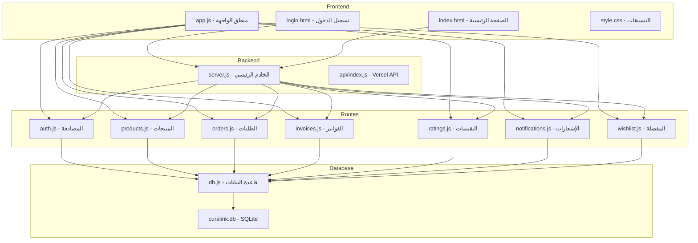
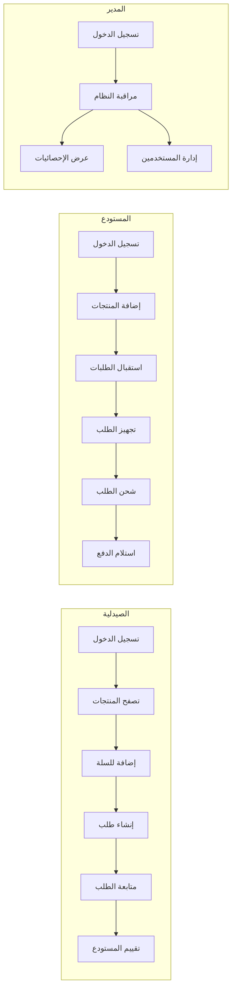

# خطة تطوير نظام CuraLink - الوساطة الدوائية

## نظرة عامة على النظام

**CuraLink** هو نظام وساطة دوائية يربط بين المستودعات والصيدليات، حيث يمكن للمستودعات عرض منتجاتهم ويمكن للصيدليات تصفحها وطلبها.

---

## هيكل النظام

---

## أنواع المستخدمين

| الدور | الوصف | الصلاحيات |
|-------|-------|----------|
| **Admin** | مدير النظام | إدارة كاملة، عرض جميع الطلبات والفواتير والإحصائيات |
| **Warehouse** | المستودع | إضافة/تعديل المنتجات، استقبال الطلبات، إدارة الفواتير |
| **Pharmacy** | الصيدلية | تصفح المنتجات، إضافة للمفضلة، إنشاء الطلبات، التقييم |

---

## خطة التطوير لكل جزء

### 1. نظام المصادقة - routes/auth.js

#### الوظائف الحالية:
- تسجيل حساب جديد للمستودعات والصيدليات
- تسجيل الدخول بالبريد وكلمة المرور
- الحصول على بيانات المستخدم الحالي
- استخدام JWT للمصادقة

#### المقترحات للتطوير:

| الأولوية | المهمة | الوصف |
|----------|--------|-------|
| 🔴 عالية | إعادة تعيين كلمة المرور | إضافة نقطة نهاية لإرسال رابط إعادة تعيين كلمة المرور via Email |
| ✅ مكتمل | تحديث الملف الشخصي | تم تنفيذ صفحة الملف الشخصي مع API لتحديث الهاتف والعنوان |
| 🟡 متوسطة | تذكرني | إضافة خيار Remember Me لتجديد الـ Token تلقائياً |
| 🟡 متوسطة | تسجيل الخروج من جميع الأجهزة | إضافة Token Blacklist أو إصدار Refresh Token |
| 🟢 منخفضة | التحقق من البريد الإلكتروني | إرسال رابط تحقق عند التسجيل الجديد |
| 🟢 منخفضة | تسجيل الدخول بـ OAuth | دعم Google أو Facebook Login |

---

### 2. نظام المنتجات - routes/products.js

#### الوظائف الحالية:
- إضافة منتج جديد مع صورة
- تعديل وحذف المنتجات
- استيراد منتجات من ملفات Excel/CSV
- البحث والتصفية حسب الفئة والمستودع
- نظام العروض والخصومات والبونص

#### المقترحات للتطوير:

| الأولوية | المهمة | الوصف |
|----------|--------|-------|
| 🔴 عالية | تنبيه انخفاض المخزون | إرسال إشعار تلقائي عند انخفاض الكمية عن حد معين |
| 🔴 عالية | تاريخ انتهاء الصلاحية | تنبيه قبل انتهاء الصلاحية بفترة محددة |
| 🟡 متوسطة | تصدير المنتجات | إضافة خاصية تصدير المنتجات إلى Excel |
| 🟡 متوسطة | تاريخ الأسعار | حفظ تاريخ تغيير الأسعار للمقارنة |
| 🟡 متوسطة | فئات فرعية | دعم فئات فرعية للمنتجات |
| 🟢 منخفضة | باركود المنتج | إضافة دعم للباركود والـ QR Code |
| 🟢 منخفضة | صور متعددة | السماح بإضافة أكثر من صورة للمنتج |

---

### 3. نظام الطلبات - routes/orders.js

#### الوظائف الحالية:
- إنشاء طلب جديد من الصيدلية
- عرض الطلبات للمستودع والصيدلية والمدير
- تحديث حالة الطلب: pending, processing, shipped, delivered, cancelled
- حساب العمولة 10%
- تتبع الطلب (Timeline) للأحداث: إنشاء الطلب، تغيير الحالة، الإلغاء، الحذف المنطقي، عرض التفاصيل
- إرجاع `order.timeline` ضمن `GET /api/orders/:id`
- تطبيق الحذف المنطقي للطلب (`is_deleted`, `deleted_at`) بدل الحذف الفعلي
- استبعاد الطلبات المحذوفة منطقيًا من قوائم الطلبات الافتراضية
- فرض انتقالات حالة صريحة لمنع الانتقالات غير الصحيحة

#### المقترحات للتطوير:

| الأولوية | المهمة | الوصف |
|----------|--------|-------|
| ✅ مُنفذ | تتبع الطلب | تم تنفيذ نظام Timeline وربطه بالـ API والواجهة |
| ✅ مُنفذ | إلغاء الطلب بزمن محدد | تم إضافة نافذة إلغاء (قابلة للضبط) قبل السماح بإلغاء طلب الصيدلية |
| ✅ مُنفذ | إرجاع المنتجات | تم إضافة جداول ونقاط نهاية أساسية لنظام المرتجعات مع حالات معالجة |
| ✅ مُنفذ | تاريخ التسليم المتوقع | تم إضافة الحقل ونقطة نهاية لتحديثه من طرف المستودع |
| ✅ مُنفذ | ملاحظات الطلب | تم إضافة ملاحظات من طرفي الصيدلية والمستودع |
| 🟢 منخفضة (منفذ جزئي) | طباعة أمر التوريد | تم إنشاء نسخة HTML قابلة للطباعة (Print to PDF) |
| 🟢 منخفضة (منفذ جزئي) | إشعارات SMS | تم تنفيذ Queue داخلي للإشعار تمهيدًا للربط مع مزود SMS خارجي |

---

### 4. نظام الفواتير - routes/invoices.js

#### الوظائف الحالية:
- إنشاء فاتورة تلقائياً مع الطلب
- عرض الفواتير للمستودع والمدير
- حساب صافي المبلغ بعد خصم العمولة
- حالة الدفع: pending, paid

#### المقترحات للتطوير:

| الأولوية | المهمة | الوصف |
|----------|--------|-------|
| ✅ مُنفذ (عملي) | طباعة الفاتورة | تم إنشاء نسخة HTML قابلة للطباعة/الحفظ كـ PDF |
| ✅ مُنفذ | سجل المدفوعات | تم إضافة سجل دفعات جزئية `invoice_payments` مع مزامنة حالة الفاتورة |
| 🟡 منفذ جزئي | إرسال الفاتورة بالبريد | تم إضافة Email Queue داخلي تمهيدًا للربط مع SMTP |
| ✅ مُنفذ | تقارير مالية | تم إضافة Endpoint للتقارير الشهرية/السنوية |
| 🟢 منفذ مبدئي | تكامل بوابات الدفع | تم إضافة إدارة إعدادات البوابات (Config) بانتظار الربط الفعلي |
| 🟢 منخفضة | جدولة المدفوعات | جدولة مواعيد السداد |

---

### 5. نظام التقييمات - routes/ratings.js

#### الوظائف الحالية:
- تقييم المستودع من 1 إلى 5 نجوم
- إضافة تعليق مع التقييم
- تحديث متوسط تقييم المستودع تلقائياً

#### المقترحات للتطوير:

| الأولوية | المهمة | الوصف |
|----------|--------|-------|
| 🟡 متوسطة | تعديل التقييم | السماح بتعديل التقييم خلال فترة محددة |
| 🟡 متوسطة | رد المستودع | السماح للمستودع بالرد على التقييم |
| 🟡 متوسطة | تقييم المنتج | إضافة تقييم لكل منتج بشكل منفصل |
| 🟢 منخفضة | الإبلاغ عن تقييم | الإبلاغ عن التقييمات غير اللائقة |
| 🟢 منخفضة | تقييم الصيدلية | السماح للمستودعات بتقييم الصيدليات |

---

### 6. نظام الإشعارات - routes/notifications.js

#### الوظائف الحالية:
- إنشاء إشعارات للمستخدم
- عرض الإشعارات غير المقروءة
- تحديد الإشعار كمقروء
- حذف الإشعار

#### المقترحات للتطوير:

| الأولوية | المهمة | الوصف |
|----------|--------|-------|
| 🔴 عالية | Push Notifications | إضافة دعم للإشعارات الفورية في المتصفح |
| 🔴 عالية | إشعارات البريد | إرسال نسخة من الإشعار بالبريد |
| 🟡 متوسطة | تخصيص الإشعارات | السماح للمستخدم باختيار أنواع الإشعارات |
| 🟡 متوسطة | تجميع الإشعارات | تجميع الإشعارات المتشابهة |
| 🟢 منخفضة | إشعارات SMS | إرسال إشعارات مهمة عبر SMS |

---

### 7. نظام المفضلة - routes/wishlist.js

#### الوظائف الحالية:
- إضافة منتج للمفضلة
- إزالة منتج من المفضلة
- عرض قائمة المفضلة

#### المقترحات للتطوير:

| الأولوية | المهمة | الوصف |
|----------|--------|-------|
| 🟡 متوسطة | تنبيه تغيير السعر | إشعار عند تغيير سعر منتج في المفضلة |
| 🟡 متوسطة | تنبيه العرض | إشعار عند إضافة عرض على منتج مفضل |
| 🟢 منخفضة | مجلدات المفضلة | تنظيم المفضلة في مجلدات |
| 🟢 منخفضة | مشاركة المفضلة | مشاركة قائمة المفضلة مع مستخدمين آخرين |

---

### 8. قاعدة البيانات - database/db.js

#### الجداول الحالية:
- `users` - المستخدمين
- `products` - المنتجات
- `orders` - الطلبات
- `order_items` - عناصر الطلب
- `invoices` - الفواتير
- `ratings` - التقييمات
- `notifications` - الإشعارات
- `wishlist` - المفضلة

#### المقترحات للتطوير:

| الأولوية | المهمة | الوصف |
|----------|--------|-------|
| 🔴 عالية | فهرسة الأداء | إضافة فهارس على الأعمدة المستخدمة بكثرة |
| 🔴 عالية | النسخ الاحتياطي | جدولة نسخ احتياطي تلقائي |
| 🟡 متوسطة | سجل التغييرات | جدول لتتبع التغييرات على البيانات |
| 🟡 متوسطة | الإعدادات | جدول لإعدادات النظام |
| 🟢 منخفضة | الترحيل إلى PostgreSQL | لتحسين الأداء مع البيانات الكبيرة |

---

### 9. الواجهة الأمامية - public/js/app.js

#### الوظائف الحالية:
- نظام التنقل بين الصفحات
- إدارة السلة
- عرض المنتجات والطلبات
- التواصل مع API

#### المقترحات للتطوير:

| الأولوية | المهمة | الوصف |
|----------|--------|-------|
| 🔴 عالية | وضع عدم الاتصال | دعم PWA للعمل بدون إنترنت |
| 🔴 عالية | تحسين الأداء | Lazy Loading للصور والمكونات |
| 🟡 متوسطة | الوضع المظلم | إضافة Dark Mode |
| 🟡 متوسطة | اختصارات لوحة المفاتيح | إضافة اختصارات للتنقل السريع |
| 🟡 متوسطة | تحسين التجوال على الموبايل | تحسين تجربة المستخدم على الشاشات الصغيرة |
| 🟢 منخفضة | دعم لغات متعددة | إضافة دعم للغة الإنجليزية |

---

### 10. واجهة المستخدم - public/css/style.css

#### المقترحات للتطوير:

| الأولوية | المهمة | الوصف |
|----------|--------|-------|
| 🟡 متوسطة | CSS Variables | استخدام CSS Variables للألوان والأحجام |
| 🟡 متوسطة | تحسين الطباعة | إضافة Print Stylesheet |
| 🟢 منخفضة | الرسوم المتحركة | إضافة انتقالات سلسة بين الصفحات |

---

## مخطط تدفق المستخدم

---

## أولويات التطوير المقترحة

### المرحلة الأولى - الأساسيات
1. ✅ نظام المصادقة الأساسي
2. ✅ إدارة المنتجات
3. ✅ نظام الطلبات
4. ✅ الفواتير

### المرحلة الثانية - التحسينات
1. 🔴 تنبيهات انخفاض المخزون
2. 🔴 تنبيهات انتهاء الصلاحية
3. 🔴 تتبع الطلبات
4. 🔴 Push Notifications
5. 🔴 طباعة الفواتير

### المرحلة الثالثة - التوسع
1. 🟡 نظام المرتجعات
2. 🟡 تقارير متقدمة
3. 🟡 PWA
4. 🟡 الوضع المظلم

### المرحلة الرابعة - التكامل
1. 🟢 بوابات الدفع
2. 🟢 SMS Notifications
3. 🟢 OAuth Login
4. 🟢 دعم اللغة الإنجليزية

---

## ملاحظات تقنية

### نقاط القوة
- هيكل نظيف ومنظم
- استخدام JWT للمصادقة
- دعم استيراد Excel/CSV
- نظام عمولات مدمج

### نقاط تحتاج تحسين
- إدارة الأخطاء تحتاج تحسين
- إضافة اختبارات وحدة
- تحسين الأمان مع Rate Limiting
- إضافة Logging متقدم

---

## الخلاصة

هذه الخطة توفر خارطة طريق واضحة لتطوير نظام CuraLink. يمكن البدء بالمرحلة الأولى ثم التدرج حسب الأولويات واحتياجات العمل.

---

## Tracking Feature - In Progress

### Current Sprint
- Order timeline feature has started.
- Scope includes: order creation, status transitions, cancellation/soft deletion, and order details view events.

### Implemented Design Notes
- Added `order_events` audit table and timeline indexes.
- Added soft-delete support on `orders` (`is_deleted`, `deleted_at`).
- Upgraded invoice status compatibility to include `cancelled` with `cancelled_at` support.
- `/api/orders/:id` now returns `order.timeline` in ascending chronological order.
- `DELETE /api/orders/:id` behavior is now logical cancel instead of physical delete.

### Acceptance Criteria (Sprint Focus)
- New orders create `order_created` events.
- Valid state transitions create ordered `order_status_changed` events.
- Cancellation updates order + invoice consistently and restores stock when required.
- Soft-deleted orders are excluded from standard order list endpoints.
- Order details modal shows full timeline without extra API calls.
