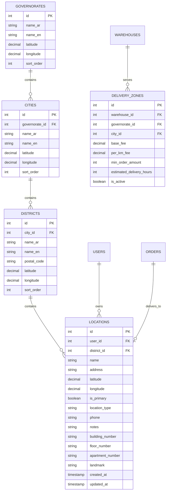
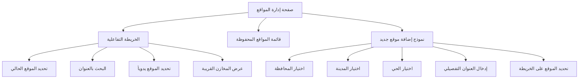

# خطة نظام المواقع الجغرافية المتكامل لـ CuraLink

## نظرة عامة
تطوير نظام مواقع جغرافية شامل يدعم:
- إدارة المواقع للصيدليات والمخازن
- خريطة تفاعلية لتحديد المواقع
- نظام مناطق جغرافية متقدم (محافظات، مدن، أحياء)
- تحسين نظام التوصيل بناءً على الموقع

---

## 1. تحليل الوضع الحالي

### الموجود حالياً:

#### جدول `locations` (من migration 003):
```sql
CREATE TABLE locations (
    id SERIAL PRIMARY KEY,
    user_id INTEGER NOT NULL REFERENCES users(id),
    name TEXT NOT NULL,
    address TEXT,
    latitude DECIMAL(10, 8) NOT NULL,
    longitude DECIMAL(11, 8) NOT NULL,
    is_primary INTEGER DEFAULT 0,
    location_type TEXT CHECK(location_type IN ('warehouse', 'pharmacy', 'delivery_point')),
    phone TEXT,
    notes TEXT,
    created_at TIMESTAMP WITH TIME ZONE DEFAULT CURRENT_TIMESTAMP,
    updated_at TIMESTAMP WITH TIME ZONE DEFAULT CURRENT_TIMESTAMP
);
```

#### أعمدة في جدول `users`:
- `latitude`, `longitude` - إحداثيات GPS
- `gps_address` - العنوان من GPS
- `zone` - النطاق الجغرافي (القاهرة الكبرى، الإسكندرية، إلخ)

#### API Routes في [`routes/locations.js`](routes/locations.js):
- `GET /api/locations` - جلب مواقع المستخدم
- `POST /api/locations` - إضافة موقع جديد
- `PUT /api/locations/:id` - تحديث موقع
- `DELETE /api/locations/:id` - حذف موقع
- `GET /api/locations/warehouses/nearby` - البحث عن مخازن قريبة
- `POST /api/locations/distance` - حساب المسافة بين نقطتين

### المشاكل الحالية:
1. لا توجد مناطق جغرافية هرمية (محافظات → مدن → أحياء)
2. واجهة المستخدم للخريطة بسيطة جداً
3. لا يوجد نظام تحديد نطاق التوصيل
4. لا يوجد حساب تكلفة التوصيل بناءً على المسافة

---

## 2. التصميم الجديد

### 2.1 هيكل قاعدة البيانات الجديد



### 2.2 المناطق الجغرافية المصرية

#### المحافظات الرئيسية:
| ID | الاسم بالعربية | الاسم بالإنجليزية |
|----|---------------|------------------|
| 1  | القاهرة       | Cairo            |
| 2  | الجيزة        | Giza             |
| 3  | الإسكندرية    | Alexandria       |
| 4  | الدقهلية      | Dakahlia         |
| 5  | الشرقية       | Sharqia          |
| 6  | الغربية       | Gharbia          |
| 7  | المنوفية      | Monufia          |
| 8  | القليوبية     | Qalyubia         |
| 9  | كفر الشيخ     | Kafr El Sheikh   |
| 10 | الغربية       | Beheira          |
| 11 | اسوان         | Aswan            |
| 12 | أسيوط         | Assiut           |
| 13 | سوهاج         | Sohag            |
| 14 | المنيا        | Minya            |
| 15 | بني سويف      | Beni Suef        |
| 16 | الفيوم        | Fayoum           |
| 17 | السويس        | Suez             |
| 18 | الإسماعيلية   | Ismailia         |
| 19 | بورسعيد       | Port Said        |
| 20 | دمياط         | Damietta         |
| 21 | شمال سيناء    | North Sinai      |
| 22 | جنوب سيناء    | South Sinai      |
| 23 | البحر الأحمر  | Red Sea          |
| 24 | الوادي الجديد | New Valley       |
| 25 | مطروح         | Matrouh          |
| 26 | الأقصر        | Luxor            |
| 27 | القناة        | Canal Zone       |

### 2.3 واجهة المستخدم للخريطة التفاعلية



### 2.4 نظام التوصيل بناءً على الموقع


---

## 3. خطوات التنفيذ

### المرحلة 1: تحديث قاعدة البيانات
- [ ] إنشاء migration جديد `004_geographic_zones.sql`
- [ ] إنشاء جداول المحافظات والمدن والأحياء
- [ ] تحديث جدول `locations` بالأعمدة الجديدة
- [ ] إنشاء جدول `delivery_zones` لنطاقات التوصيل
- [ ] إضافة البيانات الأولية للمناطق المصرية

### المرحلة 2: تحديث API
- [ ] إنشاء routes جديدة للمناطق الجغرافية
- [ ] تحديث routes المواقع الحالية
- [ ] إضافة API لحساب تكلفة التوصيل
- [ ] إضافة API للتحقق من نطاق التوصيل

### المرحلة 3: واجهة المستخدم
- [ ] إنشاء صفحة إدارة المواقع
- [ ] دمج خريطة تفاعلية (Leaflet أو Google Maps)
- [ ] إنشاء نماذج إضافة/تعديل المواقع
- [ ] إضافة محدد المواقع في صفحة الطلب

### المرحلة 4: نظام التوصيل
- [ ] تحديث نظام الطلبات لدعم موقع التوصيل
- [ ] حساب تكلفة التوصيل تلقائياً
- [ ] عرض المخازن المتاحة بناءً على الموقع
- [ ] نظام تتبع التوصيل

---

## 4. التفاصيل التقنية

### 4.1 Migration الجديد

```sql
-- ملف: database/migrations/004_geographic_zones.sql

-- جدول المحافظات
CREATE TABLE IF NOT EXISTS governorates (
    id SERIAL PRIMARY KEY,
    name_ar TEXT NOT NULL UNIQUE,
    name_en TEXT,
    latitude DECIMAL(10, 8),
    longitude DECIMAL(11, 8),
    sort_order INTEGER DEFAULT 0,
    is_active INTEGER DEFAULT 1,
    created_at TIMESTAMP WITH TIME ZONE DEFAULT CURRENT_TIMESTAMP
);

-- جدول المدن
CREATE TABLE IF NOT EXISTS cities (
    id SERIAL PRIMARY KEY,
    governorate_id INTEGER NOT NULL REFERENCES governorates(id),
    name_ar TEXT NOT NULL,
    name_en TEXT,
    latitude DECIMAL(10, 8),
    longitude DECIMAL(11, 8),
    sort_order INTEGER DEFAULT 0,
    is_active INTEGER DEFAULT 1,
    created_at TIMESTAMP WITH TIME ZONE DEFAULT CURRENT_TIMESTAMP
);

-- جدول الأحياء/المناطق
CREATE TABLE IF NOT EXISTS districts (
    id SERIAL PRIMARY KEY,
    city_id INTEGER NOT NULL REFERENCES cities(id),
    name_ar TEXT NOT NULL,
    name_en TEXT,
    postal_code TEXT,
    latitude DECIMAL(10, 8),
    longitude DECIMAL(11, 8),
    sort_order INTEGER DEFAULT 0,
    is_active INTEGER DEFAULT 1,
    created_at TIMESTAMP WITH TIME ZONE DEFAULT CURRENT_TIMESTAMP
);

-- تحديث جدول المواقع
ALTER TABLE locations ADD COLUMN IF NOT EXISTS governorate_id INTEGER REFERENCES governorates(id);
ALTER TABLE locations ADD COLUMN IF NOT EXISTS city_id INTEGER REFERENCES cities(id);
ALTER TABLE locations ADD COLUMN IF NOT EXISTS district_id INTEGER REFERENCES districts(id);
ALTER TABLE locations ADD COLUMN IF NOT EXISTS building_number TEXT;
ALTER TABLE locations ADD COLUMN IF NOT EXISTS floor_number TEXT;
ALTER TABLE locations ADD COLUMN IF NOT EXISTS apartment_number TEXT;
ALTER TABLE locations ADD COLUMN IF NOT EXISTS landmark TEXT;
ALTER TABLE locations ADD COLUMN IF NOT EXISTS postal_code TEXT;
ALTER TABLE locations ADD COLUMN IF NOT EXISTS is_verified INTEGER DEFAULT 0;

-- جدول نطاقات التوصيل
CREATE TABLE IF NOT EXISTS delivery_zones (
    id SERIAL PRIMARY KEY,
    warehouse_id INTEGER NOT NULL REFERENCES users(id) ON DELETE CASCADE,
    governorate_id INTEGER REFERENCES governorates(id),
    city_id INTEGER REFERENCES cities(id),
    district_id INTEGER REFERENCES districts(id),
    zone_type TEXT DEFAULT 'radius' CHECK(zone_type IN ('radius', 'polygon', 'administrative')),
    radius_km DECIMAL(10, 2) DEFAULT 50,
    base_fee DECIMAL(10, 2) DEFAULT 0,
    per_km_fee DECIMAL(10, 2) DEFAULT 0,
    min_order_amount DECIMAL(10, 2) DEFAULT 0,
    free_delivery_threshold DECIMAL(10, 2) DEFAULT 0,
    estimated_delivery_hours INTEGER DEFAULT 24,
    is_active INTEGER DEFAULT 1,
    created_at TIMESTAMP WITH TIME ZONE DEFAULT CURRENT_TIMESTAMP,
    updated_at TIMESTAMP WITH TIME ZONE DEFAULT CURRENT_TIMESTAMP
);

-- الفهارس
CREATE INDEX IF NOT EXISTS idx_cities_governorate ON cities(governorate_id);
CREATE INDEX IF NOT EXISTS idx_districts_city ON districts(city_id);
CREATE INDEX IF NOT EXISTS idx_locations_governorate ON locations(governorate_id);
CREATE INDEX IF NOT EXISTS idx_locations_city ON locations(city_id);
CREATE INDEX IF NOT EXISTS idx_locations_district ON locations(district_id);
CREATE INDEX IF NOT EXISTS idx_delivery_zones_warehouse ON delivery_zones(warehouse_id);
CREATE INDEX IF NOT EXISTS idx_delivery_zones_governorate ON delivery_zones(governorate_id);
CREATE INDEX IF NOT EXISTS idx_delivery_zones_city ON delivery_zones(city_id);
```

### 4.2 API Endpoints الجديدة

```
# المناطق الجغرافية
GET    /api/geo/governorates           # قائمة المحافظات
GET    /api/geo/governorates/:id/cities # مدن محافظة معينة
GET    /api/geo/cities/:id/districts   # أحياء مدينة معينة
GET    /api/geo/search                 # البحث عن منطقة

# المواقع
GET    /api/locations                  # مواقع المستخدم
POST   /api/locations                  # إضافة موقع جديد
PUT    /api/locations/:id              # تحديث موقع
DELETE /api/locations/:id              # حذف موقع
POST   /api/locations/geocode          # تحويل العنوان إلى إحداثيات
POST   /api/locations/reverse-geocode  # تحويل الإحداثيات إلى عنوان

# التوصيل
GET    /api/delivery/check-coverage    # التحقق من نطاق التوصيل
POST   /api/delivery/calculate-fee     # حساب تكلفة التوصيل
GET    /api/delivery/warehouses        # المخازن المتاحة للتوصيل
```

### 4.3 واجهة المستخدم

#### صفحة إدارة المواقع:
```html
<!-- هيكل الصفحة -->
<div class="locations-page">
    <!-- الخريطة التفاعلية -->
    <div class="map-container">
        <div id="interactive-map"></div>
    </div>
    
    <!-- قائمة المواقع -->
    <div class="locations-list">
        <div class="locations-header">
            <h2>مواقعي</h2>
            <button onclick="showAddLocationModal()">إضافة موقع جديد</button>
        </div>
        <div class="locations-items">
            <!-- قائمة المواقع المحفوظة -->
        </div>
    </div>
</div>
```

#### نموذج إضافة موقع:
```html
<form id="location-form">
    <!-- اختيار المنطقة -->
    <select name="governorate" onchange="loadCities(this.value)">
        <option value="">اختر المحافظة</option>
    </select>
    <select name="city" onchange="loadDistricts(this.value)">
        <option value="">اختر المدينة</option>
    </select>
    <select name="district">
        <option value="">اختر الحي</option>
    </select>
    
    <!-- العنوان التفصيلي -->
    <input type="text" name="address" placeholder="العنوان التفصيلي">
    <input type="text" name="building_number" placeholder="رقم المبنى">
    <input type="text" name="floor_number" placeholder="الطابق">
    <input type="text" name="apartment_number" placeholder="الشقة">
    <input type="text" name="landmark" placeholder="علامة مميزة قريبة">
    
    <!-- الخريطة -->
    <div id="location-picker-map"></div>
    <input type="hidden" name="latitude">
    <input type="hidden" name="longitude">
    
    <!-- أزرار التحكم -->
    <button type="button" onclick="getCurrentLocation()">
        تحديد موقعي الحالي
    </button>
    <button type="submit">حفظ الموقع</button>
</form>
```

---

## 5. المكتبات المقترحة

### للخريطة التفاعلية:
- **Leaflet.js** - مكتبة مجانية ومفتوحة المصدر
- **OpenStreetMap** - خرائط مجانية
- أو **Google Maps API** - إذا كان الميزانية تسمح

### للـ Geocoding:
- **Nominatim** - خدمة مجانية مع OpenStreetMap
- أو **Google Geocoding API**

---

## 6. الأمان والخصوصية

- تشفير إحداثيات المواقع الحساسة
- التحقق من صلاحيات الوصول للمواقع
- عدم عرض المواقع للمستخدمين غير المصرح لهم
- تسجيل عمليات الوصول للمواقع في سجل المراجعة

---

## 7. الاختبار

- [ ] اختبار API endpoints
- [ ] اختبار واجهة المستخدم
- [ ] اختبار حساب المسافات والتكاليف
- [ ] اختبار الأداء مع عدد كبير من المواقع
- [ ] اختبار على أجهزة مختلفة

---

## 8. الجدول الزمني المقترح

| المرحلة | المهام |
|---------|--------|
| المرحلة 1 | تحديث قاعدة البيانات |
| المرحلة 2 | تحديث API |
| المرحلة 3 | واجهة المستخدم |
| المرحلة 4 | نظام التوصيل |
| المرحلة 5 | الاختبار والتحسين |

---

## ملاحظات إضافية

1. يجب مراعاة توافق النظام الجديد مع النظام الحالي
2. إضافة ترجمة للمناطق باللغتين العربية والإنجليزية
3. دعم البحث الصوتي للعناوين في المستقبل
4. إمكانية تصدير المواقع بصيغة KML/GPX
